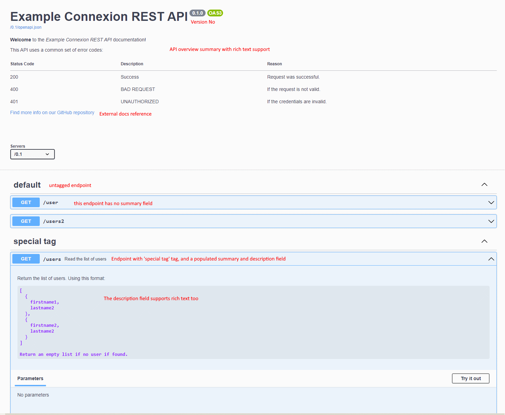

# Connexion evaluation

## Summary

`connexion` supports all of the essential features needed by an HTTP request handling framework.

Of the required features outlined below, the support for role based access is the weakest. This is because the OpenAPI specification only allows role-based access for OAuth security schemes. `connexion` mirrors the OpenAPI specification, so they also do not provide the capability to validate endpoint scopes for basic/JWT/apiKey based authentication schemes.

This shortcoming can be overcome in at least two ways:

1) hard-code the role validation into each endpoint (i.e. add logic to each endpoint that check's the user's role before responding)
2) add middleware to parse the roles for non-OAuth schemes, and pass the required role to the authentication validation methods. `connexion` purposefully does not populate the required roles to stay consistent with OpenAPI, but we should be able to add it.

The second largest shortcoming that comes with using `connexion` is that developers must also learn how to write and interpret OpenAPI specifications. This does require a several hours of study to properly master, but alternative libraries appear to have similar cognitive loads. Libraries such as `Flassger` work by moving OpenAPI specifications into the docstrings, and other frameworks work by generating OpenAPI specifications from code. Both of these approaches require a comparable understanding API design - but they use comments and code logic instead of yaml declarations.

It is also worth noting that `connexion` does not require all endpoints to use the OpenAPI specification. Native flask endpoint routing will continue to work if the endpoint is omitted from the specifications. This means that endpoints can be quickly setup for development purposes by simply appending the `@app.route` decorator to any python method.

### Tools to help write API specifications

These tools may make writing OpenAPI specifications easier. I've tried using the VS Code OpenAPI editor and it works quite well.

* [Online Swagger UI editor1](https://editor.swagger.io/)
* [VS Code OpenAPI (Swagger) Editor](https://marketplace.visualstudio.com/items?itemName=42Crunch.vscode-openapi)
  * Requires free account to use
* [REST API Design Guidelines](https://opensource.zalando.com/restful-api-guidelines/#table-of-contents)

## Requirements

Must have:

* Route requests to endpoint functions
* Validate request json
* [Optional] Validate response json
* Deserialize request json into typed endpoint parameters
* Request authentication
* Endpoint role based access --> Weakest (only provides oAUTH)
* [Optional] Swagger UI for easy debugging

Not needed:
* [Optional] Model object Json serialization and deserialization
  * Optional because model objects are independent of API input/output parameter schema
* HTTPS support, to encrypt communications

## HTTPS support, to encrypt communications

OpenAPI does allow you to specify a https server URL, but connexion does not use or enforce this information.

HTTPS support is typically enabled using a reverse proxy, such as `nginx`. With this setup `nginx` would be configured with a ssl certificate. `nginx` performs the TLS handshake to establish the session, decrypts requests to send to the application, and encrypts responses sent from the application.

You can enable https support directly (i.e. for development purposes) by passing in a ssl context, but the ssl context is not actually handled by `flask` or `connexion` - it is actually passed directly to the HTTP server [werkzeug](https://connexion.readthedocs.io/en/latest/security.html#id3) by default.

```python
from OpenSSL import SSL
context = SSL.Context(SSL.SSLv23_METHOD)
context.use_privatekey_file('yourserver.key')
context.use_certificate_file('yourserver.crt')
# neither connexion nor flask provides a 
# ssl_context parameter!
app.run(host='127.0.0.1', port='12344',
        debug=False/True, ssl_context=context)
```

## Request Routing

### Connexion

Routing paths are specified within the openAPI yaml. The routing rules can be customized while adding the api. If no resolver is specified (`resolver=None`), then connexion will use their default `connexion.resolver.Resolver` class.

`app.add_api('swagger.yaml', resolver=Resolver())`

```yaml
servers:
  - url: "/v1.2" # define the API base url

paths:
  /endpoint1: # http://HOST/v1.2/endpoint1 
    get:
      operationId: pymodule.pyfunction_get
      # ignore content for now
    post:
      operationId: pymododule.pyfunction_post
      # ignore request body and response content
    #etc
  /endpoint2: # http://HOST/v1.2/endpoint1 
    get:
      x-openapi-router-controller: users # define local relative path
      operationId: pyfunction_delete
```

Using `x-openapi-router-controller` is optional. This declaration will make the `operationId` relative. Note: `x-swagger-router-controller` is an outdated version of `x-openapi-router-controller`. Since we use OpenAPI 3.0 there is no reason to ever use this.

Custom resolvers can be used to edit the relative path of all `operationId`s. For example, all of our endpoints currently look like this:

```yaml
## Current HUU yaml pattern
path:
  /HUUEndpoint:
    get:
      operationId: func_name # First-time reader: "Is this an Id or function?"
      ## several lines down
      x-openapi-router-controller: openapi_server.controllers.controller_module
```

If we specify the proper `RelativeResolver` then we can remove each of these `x-openapi-router-controller` calls.

`app.add_api('swagger.yaml', resolver=RelativeResolver('api'))`

```yaml
## Simpler HUU yaml pattern
path:
  /HUUEndpoint:
    get:
      operationId: controller_module.func_name # First-time reader: "I recognize that module!"
```

### Flask

`connexion` does nothing to enforce OpenAPI compliant endpoint routing for endpoints that are omitted from the specification. This means that developers can quickly standup endpoints for testing purposes, before writing any OpenAPI specification code.

```python
from flask import Flask, jsonify
'''
These 'raw' flask endpoints can be used alongside our OpenAPI endpoints.
They will be missing the connexion configured features (schema validation,
authentication, swagger UI, etc). 

Also - the main module method needs to import the module containing
these endpoints. If the dev forgets this registration step, then the
endpoint will be silently left out of the API
'''
@app.route('/data', methods=['POST'])
def receive_data():
  '''
  # call by doing something like this
  curl -X POST -H "Content-Type: application/json" -d '{"key": "value"}' http://127.0.0.1:5000/data
  '''
  data = request.json
  return jsonify(data)

@app.route('/item/<int:item_id>', methods=['GET'])
def get_item(item_id):
  '''curl http://127.0.0.1:5000/item/123'''
  # For this example, let's just return the received ID in a JSON response.
  return jsonify({"received_id": item_id})
```

## Validate request json

HTTP requests can contain a lot different types of information. A robust framework should parse this information and validate that it matches our API specification expectations before invoking our endpoint function.

* Request line -> Validate that the endpoint exists for the method and URL
* Query Parameters -> Validate that all required query parameters are present and the correct type. Convert each parameter to the correct type.
* Request body -> Validate that the body content type is correct

### Connexion

`connexion` can validate query parameters and body content-type, and cast each individual parameter to the correct native python type (`int`, `str`, `float`, `bool`, `list`, `None`, `dict`). If any required parameters are missing, or if any of the type casts fail, then the request will never reach the endpoint.

To enable the validation the parameter types have to be defined. They can be defined as standalone, reusable, schema - or inline with the endpoint declaration.

```yaml

  /user:
    get:
      operationId: "users.get"
      parameters:
        - name: username
          in: query # other values: header, path, cookie, body
          # for example if specifying header then 
          # curl -X 'GET' 'http://127.0.0.1:8000/0.1/user' -H 'accept: application/json' -H 'username: username'
          required: true
          schema:
            type: string # simple, inline schema
      responses:
        "200":
          description: "Successfully found user"
          content:
            application/json:
              schema: # reusable schema
                $ref: '#/components/schemas/getUser'
  /users:
    get:
      operationId: "users.get_all"
      responses:
        "200":
          description: "Successfully read all users"
          content:
            application/json:
              schema: 
                type: array 
                items:
                  $ref: '#/components/schemas/createUser'
components:
  schemas:
    getUser:
      type: object
      properties:
        fname:
          type: string
        mname:
          type: string
        lname:
          type: string
        username:
          type: string

    createUser:
      allOf: # schemas can be generated from other schema!
        - $ref: '#/components/schemas/getUser'
        - type: object
          properties:
            password:
              type: string
```

## [Optional] Validate response json

Behavior is very similar to the request validation. Major difference is that response validation is disabled by default by connexion. Since we have control over response types, response validation is primarily used as a development tool.

`app.add_api('my_api.yaml', validate_responses=True)`

## Deserialize request json into typed endpoint parameters

Schema is used for more than validation. Connexion will also typecast to the correct expected type, so we can add typing to endpoints:

```yaml
  /typecast:
    get:
      operationId: util.typecast
      summary: Check that entpoint parameters are typecasted to their schema definition
      parameters:
        - name: a_string
          in: query
          description: A string parameter.
          required: true
          schema:
            type: string
          
        - name: an_integer
          in: query
          description: An integer parameter.
          required: true
          schema:
            type: integer

        - name: a_float
          in: query
          description: A floating point parameter.
          required: true
          schema:
            type: number
            format: float

        - name: a_boolean
          in: query
          description: A boolean parameter.
          required: true
          schema:
            type: boolean

      responses:
          '200':
            description: Parameters received and types are correct.
```

```python
def typecast(a_string: str, an_integer: int, a_float: float, a_boolean: bool):
    if not isinstance(a_string, str):
        raise TypeError("Parameter 'a_string' should be of type string.")
    
    if not isinstance(an_integer, int):
        raise TypeError("Parameter 'an_integer' should be of type integer.")
    
    if not isinstance(a_float, float):
        raise TypeError("Parameter 'a_float' should be of type float.")
    
    if not isinstance(a_boolean, bool):
        raise TypeError("Parameter 'a_boolean' should be of type boolean.")
    
    return "Parameters received and types are correct."
```

## [Optional] Model object Json serialization and deserialization

Connexion does not directly support model object serialization/deserialization. There is a good reason for this - the model schema and OpenAPI schema are not necessarily the same. OpenAPI schema defines how requests and responses should be formatted, and model schema define how the data is structured within the database. These schema should be independent of one another so that the database design can change without needing to alter the API specification.

The marshmallow library does, however, provide all of this capability and the `flask_marshmallow` module provides seamless integration.

```python
from flask_marshmallow import Marshmallow
from flask_sqlalchemy import SQLAlchemy

app = connex_app.app

db = SQLAlchemy(app)
ma = Marshmallow(app)

class User(db.Model):
    __tablename__ = "users"
    user_id = db.Column(db.Integer, primary_key=True)
    username = db.Column(db.String(32))
    password = db.Column(db.String(32))
    fname = db.Column(db.String(32))
    mname = db.Column(db.String(32))
    lname = db.Column(db.String(32))

class UserSchema(ma.SQLAlchemyAutoSchema):
    def __init__(self, **kwargs):
        super().__init__(**kwargs)
    
    class Meta:
        model = User
        sqla_session = db.session

user_schema = UserSchema()
users_schema = UserSchema(many=True)

# user_schema.dump(user) will serialize User
```

## Request authentication & Endpoint role based access

### Connexion

It is easy to specify authentication methods using OpenAPI. Connexion supports 1) api key auth, 2) username/password, 3) oAuth, and 4) jwt. The specification clearly defines how authentication credentials should be passed, and the authentication requirements can be applied to all or some endpoints.

There are a few limitations:
* OpenAPI specification outlines the authentication interface - the actual implementation is still up to us
* OpenAPI specification only supports `scopes` for oAuth. Connexion follows the OpenAPI spec, so it also does not provide roles for non-oAuth methods
  * This means that only oAuth authentication callbacks receive the `required_scopes` kwarg
  * Basic authentication can still provide scopes - but the scopes won't be captured on the OpenAPI spec w/o special logic

```yaml
  /users:
    get:
      operationId: "users.get_all"
      security:
        - FancyOath: [write] # only oAuth supports roles
        - FancyApiKeyAuth: [] # we may be able to add roles to other methods using middleware
        - UserPass: []

components:
  securitySchemes:
    FancyApiKeyAuth:      
      type: apiKey
      in: header      
      name: Authorization
      x-apikeyInfoFunc: auth.verifyToken # specify the authentication callback
    FancyOath: # Example does not work in demo app yet
      type: oauth2
      x-tokenInfoFunc: auth.verifyToken
      flows:
        implicit:
          authorizationUrl: http://127.0.0.1:8000/0.1/auth
          scopes:
            read: Allow to read 
            write: Allow to write 
            wildcard: Extreme Access
    UserPass:
      type: http
      scheme: basic
      x-basicInfoFunc: auth.verifyUserPass
```

```python
# auth.py
def verifyUserPass(username, password, required_scopes):
    ## required_scopes always None!
    user = User.query.filter(User.username==username).one_or_none()
    if user and user.password == password:
        return {
            "scope": "read write"
        }
    return None

def verifyToken(token_string, required_scopes):
    '''
    At a minimum this function should return
    the authenticated scope for token_string. 
    In practice, however, we should return a dict
    that complies with RFC 7662
    https://datatracker.ietf.org/doc/html/rfc7662
    '''
    ## required_scopes always None!
    if token_string == "read-token":
        return {
            "scope": ["read"]
        }
    elif token_string == "write-token":
        return {
            "scope": "read write"
        }
    else:
        return None
```

## [Optional] Swagger UI for easy debugging

### Connexion

Swagger UI will 'just work' if the optional swagger dependency is specified and we add a yaml open api specification. `connexion` creates the swagger UI doc using the OpenAPI yaml file.

`pip install connexion[swagger-ui]`

By default the ui will located at `baseURL/ui`. You can, however, specify a custom path if desired:

```python
options = {'swagger_url': '/'}
app = connexion.App(__name__, options=options)
```

The OpenAPI spec has some optional fields that can be used to provide more detailed OpenAPI documentation.



### Flask

`swagger` is a standalone tool, and we can use it without `connexion` if we properly define our API. This typically requires writing the api specification, but there are some tools to help.

### Flassger

Flasgger allows you to specify swagger UI through the endpoint docstring. It also supports storing as a `yaml` file.

```python
from flask import Flask, jsonify, request
from flasgger import Swagger

app = Flask(__name__)
Swagger(app)

@app.route('/items/<int:item_id>', methods=['GET'])
def get_item(item_id):
    """
    Get Item by ID
    ---
    tags:
      - Items
    parameters:
      - name: item_id
        in: path
        type: integer
        required: true
        description: ID of the item
    responses:
      200:
        description: Item retrieved
        schema:
          type: object
          properties:
            id:
              type: integer
            name:
              type: string
    """
    return jsonify({"id": item_id, "name": "Example Item"})
```
